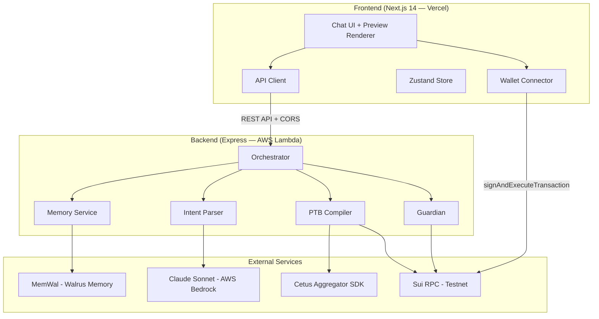
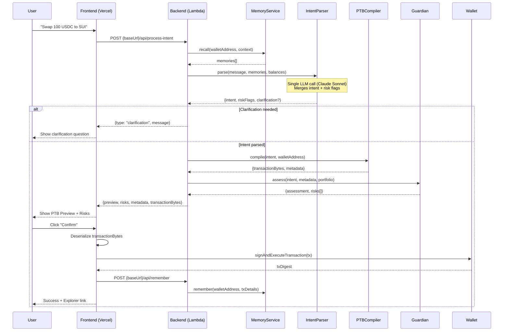
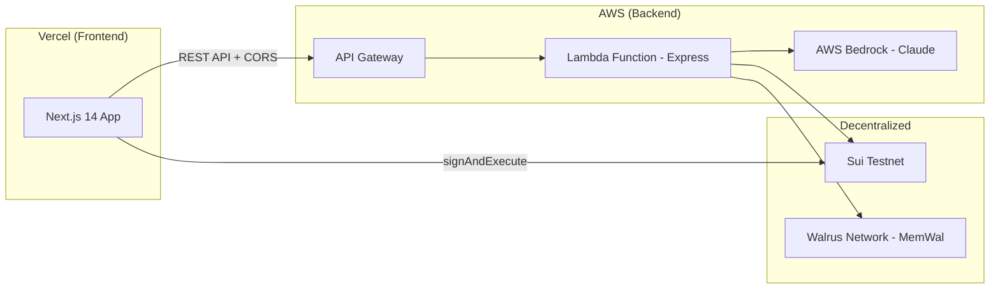
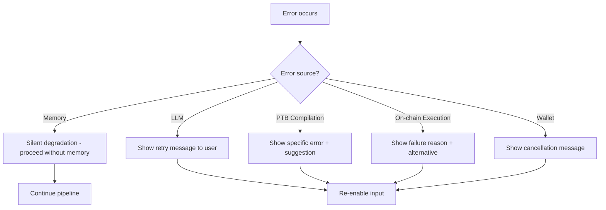

# Design Document: DeFi Copilot

## Overview

DeFi Copilot is a conversational AI assistant that converts natural-language financial goals into safe, one-click transactions on the Sui blockchain. The system follows a pipeline architecture: parse intent → compile PTB → assess risk → preview → confirm → execute → remember.

The MVP targets two hackathon tracks:
- **Agentic Web (Intent Engine)**: text → PTB → execution with human-readable preview and guardian risk checks
- **Walrus Track**: persistent memory via MemWal that makes the agent more useful over time

Key design decisions:
- **Single merged LLM call**: Intent reasoning + risk flagging in one request (latency target <5s end-to-end)
- **Separate FE/BE deployment**: Frontend (Next.js on Vercel) and Backend (Express on AWS Lambda) are independent deployments communicating via REST API
- **Desktop-only**: No mobile responsive requirement for MVP
- **Two risk classes**: Slippage (>1% price impact) and concentration (>70% single asset)
- **Two intents**: Swap (primary) and Stake (secondary)

## Architecture

### High-Level System Architecture



### Request Flow (Pipeline)



### Deployment Architecture



**Separation of concerns**:
- Frontend: UI rendering, wallet management, transaction signing/broadcasting
- Backend: LLM calls, PTB construction, risk assessment, memory storage
- Backend returns serialized transaction bytes (`base64`); frontend deserializes, signs, and broadcasts
- CORS configured on backend to allow only the frontend origin

**Local development**: Frontend runs on `localhost:3000`, backend Express server on `localhost:3001`. Frontend `NEXT_PUBLIC_API_URL=http://localhost:3001`.

## Components and Interfaces

### 1. Orchestrator (API Layer — Backend)

The central coordinator that sequences the pipeline stages. Runs as Express routes on the backend.

```typescript
// POST /api/process-intent
interface ProcessIntentRequest {
  message: string;
  walletAddress: string;
  conversationHistory: ChatMessage[];
  balances: TokenBalance[];
}

interface ProcessIntentResponse {
  type: "clarification" | "preview" | "error";
  // When type = "clarification"
  clarification?: {
    message: string;
    options?: string[];
  };
  // When type = "preview"
  preview?: {
    steps: PTBStep[];
    metadata: TransactionMetadata;
    risks: RiskWarning[];
    assessment: "safe" | "warning" | "danger";
    transactionBytes: string;  // base64 serialized Transaction for frontend to sign
  };
  // When type = "error"
  error?: {
    message: string;
    suggestion?: string;
  };
}
```

### 2. Intent Parser

Wraps the single merged LLM call to Claude Sonnet via AWS Bedrock.

```typescript
interface IntentParserInput {
  message: string;
  memories: MemoryRecord[];
  balances: TokenBalance[];
  conversationHistory: ChatMessage[];
}

interface IntentParserOutput {
  reasoning: string;         // AI's analysis (shown in chat)
  intent: StructuredIntent | null;  // null if clarification needed
  clarification: string | null;     // question to ask user
  riskFlags: {
    slippageConcern: boolean;
    concentrationConcern: boolean;
    rationale: string;
  };
  memoryIndicator: string | null;   // e.g. "Using Cetus (your preferred DEX)"
}

type StructuredIntent =
  | SwapIntent
  | StakeIntent;

interface SwapIntent {
  action: "swap";
  fromToken: string;      // e.g. "USDC"
  toToken: string;        // e.g. "SUI"
  amount: number;
  dex?: string;           // from memory or user specification
  slippageTolerance?: number; // default 1%
}

interface StakeIntent {
  action: "stake";
  token: "SUI";
  amount: number;
  validator?: string;     // from memory or user specification
}
```

### 3. PTB Compiler

Deterministic subsystem that converts structured intents into executable Sui PTBs. Returns serialized transaction bytes for frontend signing.

```typescript
interface PTBCompilerInput {
  intent: StructuredIntent;
  walletAddress: string;
}

interface PTBCompilerOutput {
  transactionBytes: string;  // base64 serialized Transaction — frontend deserializes and signs
  metadata: TransactionMetadata;
}

interface TransactionMetadata {
  type: "swap" | "stake";
  steps: PTBStep[];
  gasEstimate: number;     // in SUI
  // Swap-specific
  route?: string[];         // token path
  exchangeRate?: number;
  estimatedOutput?: number;
  minimumOutput?: number;
  priceImpact?: number;    // percentage
  // Stake-specific
  validatorName?: string;
  estimatedApy?: number;   // percentage
}

interface PTBStep {
  index: number;
  description: string;     // human-readable, e.g. "Swap 100 USDC → ~24.8 SUI via Cetus"
  type: "split" | "swap" | "stake" | "receive";
}
```

### 4. Guardian (Risk Assessment)

Deterministic risk checks on compiled PTBs.

```typescript
interface GuardianInput {
  intent: StructuredIntent;
  metadata: TransactionMetadata;
  portfolio: PortfolioBalance[];
}

interface GuardianOutput {
  assessment: "safe" | "warning" | "danger";
  risks: RiskWarning[];
}

interface RiskWarning {
  class: "HIGH_SLIPPAGE" | "CONCENTRATION";
  severity: "warning" | "elevated" | "danger";
  explanation: string;      // plain-language, one sentence
  suggestion: string;       // actionable alternative
  data: {
    // Slippage
    priceImpact?: number;
    estimatedLoss?: number;
    // Concentration
    resultingPercentage?: number;
    asset?: string;
  };
}

interface PortfolioBalance {
  token: string;
  balance: number;
  valueUsd: number;
}
```

### 5. Memory Service

Wrapper around MemWal SDK for remember/recall operations.

```typescript
interface MemoryService {
  recall(walletAddress: string, context: string, limit?: number): Promise<MemoryRecord[]>;
  remember(walletAddress: string, content: MemoryContent): Promise<void>;
}

interface MemoryRecord {
  id: string;
  type: "preference" | "transaction" | "behavioral";
  content: string;
  timestamp: number;
  metadata?: Record<string, unknown>;
}

interface MemoryContent {
  type: "preference" | "transaction";
  content: string;
  metadata?: Record<string, unknown>;
}
```

### 6. Frontend Components

Frontend is a standalone Next.js app deployed on Vercel. Communicates with backend via API client.

```typescript
// API Client (frontend/src/lib/api-client.ts)
interface ApiClient {
  processIntent(request: ProcessIntentRequest): Promise<ProcessIntentResponse>;
  remember(walletAddress: string, content: MemoryContent): Promise<void>;
  healthCheck(): Promise<{ status: string }>;
}

// Zustand Store
interface CopilotStore {
  // Wallet
  walletAddress: string | null;
  balances: TokenBalance[];

  // Chat
  messages: ChatMessage[];
  isProcessing: boolean;
  statusText: string;

  // Preview
  currentPreview: ProcessIntentResponse["preview"] | null;

  // Actions
  sendMessage(message: string): Promise<void>;
  confirmTransaction(): Promise<void>;
  cancelPreview(): void;
  connectWallet(): void;
  disconnectWallet(): void;
}

interface ChatMessage {
  id: string;
  role: "user" | "assistant";
  content: string;
  type: "text" | "preview" | "success" | "error" | "clarification";
  timestamp: number;
  metadata?: {
    memoryIndicator?: string;
    txDigest?: string;
    explorerUrl?: string;
  };
}

interface TokenBalance {
  token: string;
  symbol: string;
  balance: number;
  decimals: number;
  valueUsd?: number;
}
```

### API Endpoints Summary

Backend exposes the following REST endpoints (base URL configured per environment):

| Endpoint | Method | Purpose |
|----------|--------|---------|
| `/api/process-intent` | POST | Main pipeline: parse → compile → assess → return preview + transaction bytes |
| `/api/remember` | POST | Store memory after successful tx |
| `/api/health` | GET | Health check for backend |

All endpoints require CORS headers. Backend validates `Origin` header against allowed frontend origins.

## Data Models

### On-Chain Data (Read Only)

```typescript
// Sui coin objects for the connected wallet
interface CoinObject {
  coinType: string;        // e.g. "0x2::sui::SUI"
  objectId: string;
  balance: bigint;
}

// Validator info from Sui system state
interface ValidatorInfo {
  suiAddress: string;
  name: string;
  apy: number;            // current epoch APY
  commission: number;     // percentage
  stakingPoolActivationEpoch: number;
}
```

### Application State

```typescript
// Conversation thread (in-memory, zustand)
interface Conversation {
  id: string;
  walletAddress: string;
  messages: ChatMessage[];
  createdAt: number;
}

// Memory record stored in MemWal
interface StoredMemory {
  walletAddress: string;
  type: "preference" | "transaction";
  content: string;
  timestamp: number;
  metadata: {
    // Transaction memories
    action?: string;
    tokens?: string[];
    amounts?: number[];
    protocol?: string;
    outcome?: "success" | "failed";
    txDigest?: string;
    // Preference memories
    category?: string;     // "dex" | "slippage" | "validator"
    value?: string;
  };
}
```

### Token Registry (Static Config)

```typescript
// Known tokens on Sui Testnet
interface TokenConfig {
  symbol: string;          // "SUI", "USDC", "USDT", etc.
  coinType: string;        // full Move type path
  decimals: number;
  name: string;
  iconUrl?: string;
}

const SUPPORTED_TOKENS: TokenConfig[] = [
  { symbol: "SUI", coinType: "0x2::sui::SUI", decimals: 9, name: "Sui" },
  { symbol: "USDC", coinType: "0x...::usdc::USDC", decimals: 6, name: "USD Coin" },
  // ... additional testnet tokens
];
```

### LLM Prompt Context Shape

```typescript
// What gets sent to Claude in the single merged call
interface LLMContext {
  systemPrompt: string;    // role, capabilities, output schema
  userMessage: string;
  memories: string[];      // formatted memory strings
  balances: string;        // formatted balance summary
  conversationHistory: Array<{ role: string; content: string }>;
  supportedActions: string[];
  tokenRegistry: string[];
}
```

### Error Types

```typescript
enum ErrorCode {
  NO_ROUTE = "NO_ROUTE",
  INSUFFICIENT_BALANCE = "INSUFFICIENT_BALANCE",
  BELOW_MINIMUM = "BELOW_MINIMUM",
  UNKNOWN_TOKEN = "UNKNOWN_TOKEN",
  ROUTING_TIMEOUT = "ROUTING_TIMEOUT",
  VALIDATOR_UNAVAILABLE = "VALIDATOR_UNAVAILABLE",
  LLM_TIMEOUT = "LLM_TIMEOUT",
  LLM_ERROR = "LLM_ERROR",
  MEMORY_UNAVAILABLE = "MEMORY_UNAVAILABLE",
  TX_FAILED = "TX_FAILED",
  TX_TIMEOUT = "TX_TIMEOUT",
  WALLET_REJECTED = "WALLET_REJECTED",
}

interface AppError {
  code: ErrorCode;
  message: string;         // user-facing, plain language
  suggestion?: string;     // actionable next step
  details?: unknown;       // internal logging only
}
```


## Correctness Properties

*A property is a characteristic or behavior that should hold true across all valid executions of a system — essentially, a formal statement about what the system should do. Properties serve as the bridge between human-readable specifications and machine-verifiable correctness guarantees.*

### Property 1: Incomplete intent produces clarification naming all missing fields

*For any* structured intent where one or more required fields are missing (amount, fromToken, toToken for swaps; amount for stakes), the system SHALL produce a clarification response that explicitly names each missing field.

**Validates: Requirements 1.3**

### Property 2: Unknown token produces error naming the unrecognized symbol

*For any* token symbol string that does not exist in the supported token registry, the system SHALL produce an error response containing that exact symbol string.

**Validates: Requirements 1.6**

### Property 3: Memory preferences become intent defaults without clarification

*For any* recalled preference matching the current action type (e.g. DEX preference for a swap) combined with an intent that does not specify that field, the system SHALL use the preference value as the default and SHALL NOT produce a clarification question for that field.

**Validates: Requirements 1.5, 9.1**

### Property 4: Compiled transaction metadata contains all required fields for its action type

*For any* successfully compiled transaction, the metadata SHALL contain: for swaps — route path, exchange rate, estimated output, minimum output, price impact percentage, and gas estimate; for stakes — validator name, estimated APY, and gas estimate.

**Validates: Requirements 2.2, 3.3**

### Property 5: Insufficient balance error includes available balance and required amount

*For any* compilation attempt where the user's token balance (minus gas reserve when applicable) is less than the requested amount, the error response SHALL include the available balance value and the required amount value.

**Validates: Requirements 2.4, 3.4**

### Property 6: Default slippage tolerance calculation

*For any* swap intent where the user has not specified a slippage tolerance, the minimum output amount SHALL equal the estimated output multiplied by 0.99 (1% default tolerance).

**Validates: Requirements 2.5**

### Property 7: Highest APY validator selection

*For any* non-empty list of active validators, when the user does not specify a validator preference, the selected validator SHALL have an APY greater than or equal to every other validator in the list.

**Validates: Requirements 3.2**

### Property 8: Guardian slippage detection with data

*For any* swap transaction where price impact exceeds 1%, the Guardian SHALL produce a slippage risk warning that includes the price impact percentage and the estimated dollar loss compared to spot price.

**Validates: Requirements 4.1, 4.3**

### Property 9: Guardian concentration detection with data

*For any* transaction where the resulting single-asset concentration would exceed 70% of the user's total portfolio value, the Guardian SHALL produce a concentration risk warning that includes the resulting portfolio percentage for that asset.

**Validates: Requirements 4.2, 4.4**

### Property 10: All risk warnings contain explanation and suggestion

*For any* Guardian output containing one or more risk warnings, every risk warning SHALL have a non-empty plain-language explanation string and a non-empty actionable suggestion string.

**Validates: Requirements 4.5**

### Property 11: No risks detected implies safe assessment

*For any* transaction where price impact is ≤ 1% AND resulting single-asset concentration is ≤ 70%, the Guardian SHALL return assessment = "safe" with an empty risks array.

**Validates: Requirements 4.6**

### Property 12: Non-swap transactions skip slippage check

*For any* stake transaction (regardless of amount or validator), the Guardian SHALL never produce a slippage risk warning — only concentration risk checks apply.

**Validates: Requirements 4.7**

### Property 13: Preview renders complete data for its response type

*For any* preview response, the rendered output SHALL include: numbered step descriptions with action verbs and amounts; all metadata fields appropriate to the action type; for each risk warning — severity indicator, explanation, and suggestion; and when risks are present, the confirm button label SHALL be "Confirm Anyway".

**Validates: Requirements 5.1, 5.2, 5.3, 5.6**

### Property 14: Success message contains all required fields

*For any* successful transaction result, the success display SHALL include: action summary, actual amounts transferred, transaction digest truncated to first 8 and last 4 characters, and a valid Sui Explorer URL containing the full digest.

**Validates: Requirements 6.3**

### Property 15: Wallet address truncation and balance formatting

*For any* valid Sui wallet address, the display SHALL show the first 4 hex characters, an ellipsis, and the last 4 hex characters. *For any* SUI balance value, the display SHALL show the value rounded to exactly 2 decimal places.

**Validates: Requirements 7.2**

### Property 16: Memory record completeness on store

*For any* successful transaction, the stored memory record SHALL contain: action type, token symbols involved, amounts, protocol used, outcome status, and a timestamp within 5 seconds of confirmation.

**Validates: Requirements 8.1**

### Property 17: Preference overwrite semantics

*For any* sequence of preference stores in the same category (e.g. two DEX preferences), only the most recently stored value SHALL be returned on recall — the previous value SHALL be overwritten.

**Validates: Requirements 8.2**

### Property 18: Memory indicator names applied preference

*For any* recalled preference that is applied to the current intent as a default, the memory indicator message SHALL contain the preference category name and the preference value so the user understands why the default was chosen.

**Validates: Requirements 8.5**

### Property 19: Message input validation

*For any* string that is non-empty after trimming whitespace, the system SHALL submit it for processing. *For any* string that is empty or contains only whitespace characters, the system SHALL not submit it and SHALL not produce any response.

**Validates: Requirements 10.3**

### Property 20: LLM context assembly completeness

*For any* intent processing request, the assembled LLM context SHALL include: the user's message text, up to 10 recalled memory records, and the current wallet token balances — all present in the single request payload.

**Validates: Requirements 12.2**

### Property 21: LLM response parsing produces valid structured output

*For any* well-formed LLM response containing intent fields and risk flags, the extraction SHALL produce either a valid StructuredIntent (with correct action type and all required fields) or a clarification string — never both null simultaneously.

**Validates: Requirements 12.3**

### Property 22: Cumulative concentration considers transaction history

*For any* combination of current portfolio balances, a pending transaction, and recalled transaction history from the last 30 days, the Guardian SHALL calculate cumulative concentration by factoring in prior transactions and SHALL flag a warning when combined single-asset exposure exceeds 70%.

**Validates: Requirements 9.2**

## Error Handling

### Error Strategy

Errors are classified by source and handling approach:

| Error Source | Strategy | User Impact |
|-------------|----------|-------------|
| LLM timeout/failure | Return friendly retry message | "I couldn't process that. Please try again." |
| Cetus routing failure | Return specific pair info | "No route found for USDC → TOKEN_X" |
| Insufficient balance | Return balance details | "You have 45 USDC but need 100. Try a smaller amount." |
| Wallet rejection | Dismiss loading, show cancel msg | "Transaction cancelled." |
| Tx on-chain failure | Plain-language reason + suggestion | "Transaction failed: [reason]. Try [suggestion]." |
| Tx timeout (60s) | Timeout message + explorer link | "Couldn't confirm in time. Check Sui Explorer." |
| MemWal unavailable | Silent degradation, proceed | No user-visible error |
| MemWal store failure | Silent, log to console | Transaction success still shown |
| Validator data unavailable | Return error, block stake | "Validator info temporarily unavailable." |
| Unknown token | Error with token name | "I don't recognize 'XYZZ'. Check the token name?" |

### Error Propagation Flow



### Timeout Configuration

| Operation | Timeout | Action on Timeout |
|-----------|---------|-------------------|
| MemWal recall | 5 seconds | Proceed with empty memory |
| MemWal store | 5 seconds | Log and continue |
| LLM call (Bedrock) | 8 seconds | Return error to user |
| Cetus routing | 10 seconds | Return routing unavailable error |
| Transaction confirmation | 60 seconds | Show timeout + explorer link |

## Testing Strategy

### Property-Based Testing

This feature contains significant deterministic logic (Guardian risk calculations, balance validations, metadata completeness checks, formatting functions) that benefits from property-based testing.

**Library**: [fast-check](https://github.com/dubzzz/fast-check) (TypeScript PBT library)

**Configuration**:
- Minimum 100 iterations per property test
- Each test tagged with: `Feature: defi-copilot-hackathon, Property {N}: {title}`

**Property tests cover**:
- Guardian risk detection logic (Properties 8, 9, 10, 11, 12, 22)
- Balance validation and error formatting (Properties 5, 6)
- Metadata completeness checks (Property 4)
- Validator selection (Property 7)
- Input validation (Property 19)
- Formatting functions: address truncation, balance rounding (Property 15)
- Memory preference overwrite semantics (Property 17)
- Intent field validation and clarification logic (Properties 1, 2, 3)
- LLM context assembly (Property 20)
- LLM response parsing (Property 21)
- Preview rendering completeness (Property 13)
- Success message formatting (Property 14)
- Memory record structure (Property 16)
- Memory indicator content (Property 18)

### Unit Tests (Example-Based)

Unit tests cover specific interactions and UI state transitions:
- Wallet connect/disconnect flow
- Chat message rendering (alignment, styling)
- Typing indicator with status text
- Button state management (Confirm/Cancel)
- Auto-scroll behavior
- Loading states during transaction execution
- Cancel dismisses preview
- Safe assessment shows positive indicator

### Integration Tests

Integration tests verify external service interactions:
- LLM call produces valid response for representative inputs (5-10 cases)
- Cetus Aggregator returns routes for known testnet pairs
- MemWal store/recall round-trip across sessions
- PTB dry-run validation on Sui Testnet
- Wallet signing and broadcast flow (mocked wallet)

### Edge Case Tests

Dedicated tests for failure scenarios:
- Cetus timeout (10s) → routing unavailable error
- LLM timeout (8s) → retry message
- MemWal unavailable → graceful degradation (no errors shown)
- Memory store failure after success → success still displayed
- Wallet rejection → cancel message, return to input
- Transaction timeout (60s) → timeout message + explorer advice
- Stake amount < 1 SUI → minimum stake error
- Validator data unavailable → error message
- Preferred DEX has no route → fallback to all DEXes

### Test File Organization

```
frontend/
└── tests/
    └── unit/
        ├── chat-ui.test.ts
        ├── wallet-connection.test.ts
        ├── store.test.ts
        ├── preview.test.ts
        └── formatting.test.ts

backend/
└── tests/
    ├── properties/
    │   ├── guardian.property.test.ts      (Properties 8-12, 22)
    │   ├── ptb-compiler.property.test.ts  (Properties 4-7)
    │   ├── intent-parser.property.test.ts (Properties 1-3, 19-21)
    │   ├── memory.property.test.ts        (Properties 16-18)
    │   └── formatting.property.test.ts    (Property 15)
    ├── unit/
    │   ├── orchestrator.test.ts
    │   ├── guardian.test.ts
    │   └── ptb-compiler.test.ts
    ├── integration/
    │   ├── llm-intent.integration.test.ts
    │   ├── cetus-routing.integration.test.ts
    │   ├── memwal.integration.test.ts
    │   └── ptb-execution.integration.test.ts
    └── edge-cases/
        ├── timeouts.test.ts
        ├── degradation.test.ts
        └── wallet-errors.test.ts
```
