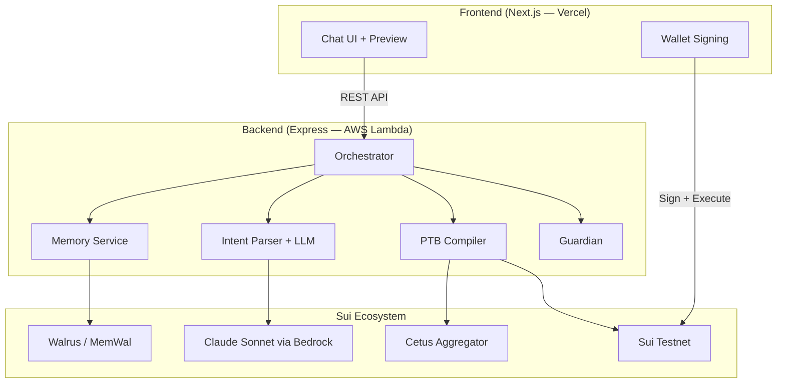

# DeFi Copilot

**Your AI-powered DeFi assistant on Sui — just say what you want.**


-purple)


---

## The Problem

DeFi on Sui is powerful, but using it requires understanding liquidity pools, slippage, routing, and navigating multiple protocol UIs. Most crypto holders never touch DeFi because the barrier is too high.

## The Solution

DeFi Copilot lets you interact with DeFi through conversation. Type your financial goal in plain English — the AI handles everything else safely.

```
You: "Swap 100 USDC to SUI"

Copilot: Compiling transaction...
         ┌───────────────────────────────────────┐
         │ 📋 Transaction Preview                 │
         │                                        │
         │ ① Swap 100 USDC → ~24.8 SUI via Cetus │
         │ ② Receive minimum 24.55 SUI            │
         │                                        │
         │ Rate: 1 SUI ≈ $4.03                    │
         │ Price impact: 0.3%                     │
         │ ✅ No risks detected                   │
         │                                        │
         │ [Confirm & Sign]     [Cancel]           │
         └───────────────────────────────────────┘
```

**Nothing executes until you explicitly confirm.**

---

## Why This Is Not "Just a Chatbot"

| Generic LLM wrapper | DeFi Copilot |
|---------------------|--------------|
| Parses text → calls API | **Reasons** about your financial goals, compares protocols, recommends with explanation |
| No risk awareness | **Guardian AI** catches slippage (>1%) and concentration risk (>70% single-asset) before every transaction |
| Stateless | **Remembers** your preferences and history across sessions via Walrus — gets smarter over time |
| Could work on any chain | **Cannot exist without Sui** — PTBs enable atomic multi-step, Move objects enable guardian inspection |

---

## Demo

🎬 **[Demo Video (YouTube)](https://youtube.com/...)** *(≤ 5 min)*

🌐 **[Live App](https://defi-copilot.vercel.app)** — Connect your Sui Testnet wallet and try it

---

## How It Works

```
"Swap 100 USDC to SUI"
        │
        ▼
┌─── Recall Memory (Walrus/MemWal) ───┐
│ "User prefers Cetus, moderate risk"  │
└──────────────────────────────────────┘
        │
        ▼
┌─── AI Intent Reasoning (Claude) ────┐
│ Parse goal → structured intent       │
│ Apply memory defaults (skip asking)  │
│ Flag potential risks                 │
└──────────────────────────────────────┘
        │
        ▼
┌─── PTB Compiler (Cetus + Sui SDK) ──┐
│ Find best route via Cetus Aggregator │
│ Build atomic Sui PTB                 │
│ Set slippage protection (1%)         │
└──────────────────────────────────────┘
        │
        ▼
┌─── Guardian (Risk Assessment) ──────┐
│ Check price impact > 1%? → warn     │
│ Check concentration > 70%? → warn   │
│ Consider tx history (last 30 days)  │
└──────────────────────────────────────┘
        │
        ▼
    Human-readable Preview
    User clicks "Confirm"
        │
        ▼
    Sign with wallet → Execute on Sui
        │
        ▼
    Store to Walrus Memory (for next time)
```

---

## Key Features

### 🗣️ Natural Language → Sui PTB
Type goals like "swap 100 USDC to SUI" or "stake my SUI". The system understands vague goals too — "earn yield safely" triggers a recommendation with reasoning.

### 🛡️ Guardian Risk Assessment
Every transaction is checked BEFORE preview:
- **Slippage**: flags when price impact exceeds 1%, shows estimated dollar loss
- **Concentration**: flags when a single asset would exceed 70% of your portfolio
- **Cumulative**: considers your last 30 days of trading to detect patterns (e.g., FOMO buying)

### 🧠 Persistent Memory via Walrus (MemWal)
- Session 1: "Which DEX do you prefer?" → You: "Cetus"
- Session 2: Auto-uses Cetus — no question asked. Shows "💡 Using Cetus (your preferred DEX)"
- Memory is decentralized, portable, and verifiable on Walrus

### 👁️ Human-Readable Preview
Every PTB rendered as plain-language steps. See exactly what will happen. Cancel anytime.

---

## Why Sui Specifically?

| Sui Feature | How We Use It |
|-------------|---------------|
| **PTBs** (Programmable Transaction Blocks) | Multi-step swaps compiled into single atomic transactions — all-or-nothing execution |
| **Move Objects** | Coin objects queried and validated for balance checks before compilation |
| **Walrus** | Persistent, verifiable agent memory — not locked in any single app |
| **Sui Wallet Standard** | Seamless connection via dapp-kit, user signs on-device |

**Remove Sui → app cannot exist.** PTBs are the execution layer, Walrus is the memory layer.

---

## Architecture



---

## Tech Stack

| Component | Technology |
|-----------|-----------|
| Frontend | Next.js 14, TypeScript, Tailwind, shadcn/ui |
| Wallet | @mysten/dapp-kit |
| Backend | Express.js, TypeScript, AWS Lambda |
| AI | Claude Sonnet (AWS Bedrock) — single merged call |
| DEX | Cetus Aggregator SDK |
| Blockchain | @mysten/sui SDK, Sui Testnet |
| Memory | MemWal (Walrus Memory) |
| Testing | 170+ tests (Vitest + fast-check property-based) |

---

## Track Requirements

### ✅ Agentic Web — Intent Engine (Sub-track 3)

| Requirement | Status |
|-------------|--------|
| Text → PTB → execution flow | ✅ Full e2e on Sui Testnet |
| Human-readable PTB preview | ✅ Numbered steps with amounts, rates, gas |
| Guardian catches ≥2 risk classes | ✅ Slippage + Concentration (with cumulative history) |
| Explicit confirmation step | ✅ Nothing executes without user click |

### ✅ Walrus Track

| Requirement | Status |
|-------------|--------|
| Long-term memory persists across sessions | ✅ Close browser → reopen → recalls preferences |
| Agent becomes more useful with memory | ✅ Session 2 skips clarification questions |
| Memory is portable and verifiable | ✅ Stored on Walrus via MemWal SDK |
| Working system, not just a demo | ✅ Full integration with real MemWal |

---

## Run Locally

```bash
# Backend
cd backend && npm install && cp .env.example .env && npm run dev

# Frontend (new terminal)
cd frontend && npm install && npm run dev

# Open http://localhost:3000
```

See [docs/DEPLOYMENT.md](docs/DEPLOYMENT.md) for production deployment guide.

---

## License

MIT
