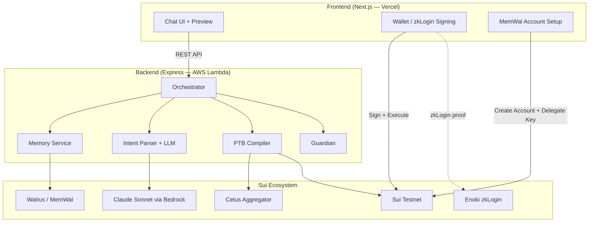

# Marina Copilot

**Your AI-powered DeFi assistant on Sui — just say what you want.**


-purple)


---

## The Problem

DeFi on Sui is powerful, but using it requires understanding liquidity pools, slippage, routing, and navigating multiple protocol UIs. Most crypto holders never touch DeFi because the barrier is too high.

## The Solution

Marina Copilot lets you interact with DeFi through conversation. Type your financial goal in plain English — the AI handles everything else safely.

```
You: "Swap 100 USDC to SUI"

Marina: Compiling transaction...
        ┌───────────────────────────────────────┐
        │ 📋 Transaction Preview                 │
        │                                        │
        │ ① Swap 100 USDC → ~24.8 SUI via Cetus │
        │ ② Receive minimum 24.55 SUI            │
        │                                        │
        │ Rate: 1 SUI ≈ $4.03                    │
        │ Price impact: 0.3%                     │
        │ ✅ No risks detected                   │
        │                                        │
        │ [Confirm & Sign]     [Cancel]           │
        └───────────────────────────────────────┘
```

**Nothing executes until you explicitly confirm.**

---

## Why This Is Not "Just a Chatbot"

| Generic LLM wrapper | Marina Copilot |
|---------------------|----------------|
| Parses text → calls API | **Reasons** about your financial goals, compares protocols, recommends with explanation |
| No risk awareness | **Guardian AI** catches slippage (>1%) and concentration risk (>70% single-asset) before every transaction |
| Stateless | **Remembers** your preferences and history across sessions via Walrus — gets smarter over time |
| Could work on any chain | **Cannot exist without Sui** — PTBs enable atomic multi-step, Walrus enables memory, Seal encrypts data |

---

## Demo

🎬 **[Demo Video (YouTube)](https://youtube.com/...)** *(≤ 5 min)*

🌐 **[Live App](https://marina-copilot.vercel.app)** — Connect your Sui Testnet wallet and try it

---

## How It Works

```
"Swap 100 USDC to SUI"
        │
        ▼
┌─── Recall Memory (Walrus/MemWal) ───┐
│ Per-user on-chain account            │
│ "User prefers Cetus, moderate risk"  │
└──────────────────────────────────────┘
        │
        ▼
┌─── AI Intent Reasoning (Claude) ────┐
│ Parse goal → structured intent       │
│ Apply memory defaults (skip asking)  │
│ Detect query vs transaction          │
└──────────────────────────────────────┘
        │
        ▼
┌─── PTB Compiler (Cetus + Sui SDK) ──┐
│ Find best route via Cetus Aggregator │
│ Build atomic Sui PTB                 │
│ DEX fallback if preferred unavailable│
└──────────────────────────────────────┘
        │
        ▼
┌─── Guardian (Risk Assessment) ──────┐
│ Check price impact > 1%? → warn     │
│ Check concentration > 70%? → warn   │
│ Consider tx history (last 30 days)  │
└──────────────────────────────────────┘
        │
        ▼
    Human-readable Preview
    User clicks "Confirm"
        │
        ▼
    Sign with wallet / zkLogin → Execute on Sui
        │
        ▼
    Store to Walrus Memory (for next time)
```

---

## Key Features

### 🗣️ Natural Language → Sui PTB
- **Transaction intents**: "swap 100 USDC to SUI", "stake 5 SUI" → compile PTB → preview → confirm
- **Read-only queries**: "What's my balance?", "Show history" → instant response, no confirmation needed
- **Smart defaults**: remembers your preferences, skips repetitive questions

### 🛡️ Guardian Risk Assessment
Every transaction is checked BEFORE preview:
- **Slippage**: flags when price impact exceeds 1%, shows estimated dollar loss
- **Concentration**: flags when a single asset would exceed 70% of your portfolio
- **Cumulative**: considers your last 30 days of trading to detect patterns
- **DEX fallback**: if preferred DEX has no route, automatically tries alternatives

### 🧠 Persistent Memory via Walrus (MemWal) — User Owns
- Each user creates their own MemWal account **on-chain** (one-time setup)
- User delegates access to app via Ed25519 key (revocable anytime)
- Memory encrypted (Seal) and stored on Walrus (decentralized, portable)
- Cross-session persistence: close browser → reopen → recalls preferences

### 🔑 Dual Authentication
- **Wallet extension**: Sui Wallet, Suiet, etc. (standard dapp-kit)
- **zkLogin (Google)**: Sign in with Google — no seed phrase needed (via Enoki)

### 👁️ Human-Readable Preview
Every PTB rendered as plain-language steps. See exactly what will happen. Cancel anytime.

---

## Why Sui Specifically?

| Sui Feature | How We Use It |
|-------------|---------------|
| **PTBs** | Multi-step swaps compiled into single atomic transactions |
| **Move Objects** | Coin objects validated for balance checks before compilation |
| **Walrus** | Persistent, verifiable agent memory — user-owned, encrypted |
| **Seal** | Threshold encryption for memory data |
| **zkLogin** | Google OAuth → Sui address via zero-knowledge proofs |

**Remove Sui → app cannot exist.** PTBs are the execution layer, Walrus is the memory layer, Seal is the encryption layer.

---

## Architecture



---

## Tech Stack

| Component | Technology |
|-----------|-----------|
| Frontend | Next.js 14, TypeScript, Tailwind |
| Wallet | @mysten/dapp-kit + zkLogin (Enoki) |
| Backend | Express.js, TypeScript, AWS Lambda |
| AI | Claude Sonnet (AWS Bedrock) — single merged call |
| DEX | Cetus Aggregator SDK |
| Blockchain | @mysten/sui SDK, Sui Testnet |
| Memory | @mysten-incubation/memwal (per-user accounts) |
| Testing | 200+ tests (Vitest + fast-check property-based) |

---

## Track Requirements

### ✅ Agentic Web — Intent Engine (Sub-track 3)

| Requirement | Status |
|-------------|--------|
| Text → PTB → execution flow | ✅ Full e2e on Sui Testnet |
| Human-readable PTB preview | ✅ Numbered steps with amounts, rates, gas |
| Guardian catches ≥2 risk classes | ✅ Slippage + Concentration (with cumulative history) |
| Explicit confirmation step | ✅ Nothing executes without user click |
| Read-only queries without confirm | ✅ Balance, history — instant response |

### ✅ Walrus Track

| Requirement | Status |
|-------------|--------|
| Long-term memory persists across sessions | ✅ Close browser → reopen → recalls preferences |
| Agent becomes more useful with memory | ✅ Session 2 skips clarification questions |
| Memory is portable and verifiable | ✅ Per-user MemWal accounts on-chain, user owns data |
| User can revoke access | ✅ Remove delegate key on-chain |
| Working system, not just a demo | ✅ Full integration with real MemWal SDK |

---

## Run Locally

```bash
# Backend
cd backend && npm install && cp .env.example .env && npm run dev

# Frontend (new terminal)
cd frontend && npm install && cp .env.example .env.local && npm run dev

# Open http://localhost:3000
```

### Environment Variables

**Backend** (`.env`):
- `AWS_ACCESS_KEY_ID` / `AWS_SECRET_ACCESS_KEY` — for Bedrock LLM
- `BEDROCK_MODEL_ID` — Claude Sonnet model
- `SUI_RPC_URL` — Sui Testnet fullnode
- `MEMWAL_SERVER_URL` — MemWal relayer

**Frontend** (`.env.local`):
- `NEXT_PUBLIC_API_URL` — Backend URL
- `NEXT_PUBLIC_GOOGLE_CLIENT_ID` — Google OAuth (for zkLogin)
- `NEXT_PUBLIC_ENOKI_API_KEY` — Enoki managed zkLogin

See [docs/DEPLOYMENT.md](docs/DEPLOYMENT.md) for production deployment guide.

---

## License

MIT
