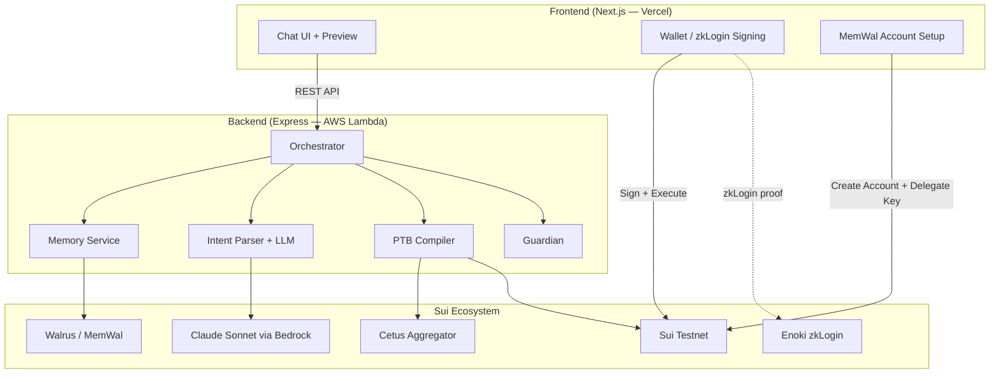

# Marina Copilot

**AI copilot with persistent memory, encrypted capsules, and decentralized storage — powered by Walrus on Sui.**


---

## The Problem

AI assistants today are stateless — they forget everything between sessions. Users repeat themselves, lose context, and can't trust AI with sensitive data because it's stored on centralized servers they don't control.

## The Solution

Marina Copilot gives AI **persistent, user-owned memory** on Walrus. Your preferences, history, and encrypted data live on decentralized storage — controlled by your on-chain keys, revocable anytime.

```
You: "Create a capsule for tomorrow: Happy Birthday!"

Marina: Encrypting with Seal...
        ┌───────────────────────────────────────┐
        │ 🔒 Time Capsule Created                │
        │                                        │
        │ Encrypted with Seal threshold crypto   │
        │ Stored on Walrus: SxboTYV8...          │
        │ Unlocks: Jun 21, 2026 00:00            │
        │ Recipient: 0x6bd0...4284               │
        │                                        │
        │ 🔗 View on Explorer                    │
        └───────────────────────────────────────┘
```

**Only the recipient can decrypt after the time-lock expires.**

---

## Why This Is Not "Just a Chatbot"

| Generic LLM wrapper | Marina Copilot |
|---------------------|----------------|
| Parses text → calls API | **Reasons** about your financial goals, compares protocols, recommends with explanation |
| No risk awareness | **Guardian AI** catches slippage (>1%) and concentration risk (>70% single-asset) before every transaction |
| Stateless | **Remembers** your preferences and history across sessions via Walrus — gets smarter over time |
| Could work on any chain | **Cannot exist without Sui** — PTBs enable atomic multi-step, Walrus enables memory, Seal encrypts data |

---

## Demo

🎬 **[Demo Video (YouTube)](https://youtube.com/...)** *(≤ 5 min)*

🌐 **[Live App](https://marina-copilot.vercel.app)** — Connect your Sui Testnet wallet and try it

---

## How It Works

```
"Swap 100 USDC to SUI"
        │
        ▼
┌─── Recall Memory (Walrus/MemWal) ───┐
│ Per-user on-chain account            │
│ "User prefers Cetus, moderate risk"  │
└──────────────────────────────────────┘
        │
        ▼
┌─── AI Intent Reasoning (Claude) ────┐
│ Parse goal → structured intent       │
│ Apply memory defaults (skip asking)  │
│ Detect query vs transaction          │
└──────────────────────────────────────┘
        │
        ▼
┌─── PTB Compiler (Cetus + Sui SDK) ──┐
│ Find best route via Cetus Aggregator │
│ Build atomic Sui PTB                 │
│ DEX fallback if preferred unavailable│
└──────────────────────────────────────┘
        │
        ▼
┌─── Guardian (Risk Assessment) ──────┐
│ Check price impact > 1%? → warn     │
│ Check concentration > 70%? → warn   │
│ Consider tx history (last 30 days)  │
└──────────────────────────────────────┘
        │
        ▼
    Human-readable Preview
    User clicks "Confirm"
        │
        ▼
    Sign with wallet / zkLogin → Execute on Sui
        │
        ▼
    Store to Walrus Memory (for next time)
```

---

## Key Features

### 🔒 Time Capsules (Seal + Walrus)
- Encrypt messages with Seal threshold encryption
- Store encrypted blob on Walrus decentralized storage
- On-chain capsule metadata (blob_id, unlock_date, recipient)
- Only recipient can decrypt after time-lock expires
- Custom `seal_policy` Move contract for access control

### 🧠 Persistent Memory via Walrus (MemWal)
- Each user creates their own MemWal account **on-chain** (one-time setup)
- User delegates access to app via Ed25519 key (revocable anytime)
- Memory encrypted (Seal) and stored on Walrus (decentralized, portable)
- Cross-session persistence: close browser → reopen → recalls preferences
- AI remembers swap history, capsule creations, file uploads

### 🐘 Decentralized File Storage
- Upload files to Walrus via SDK (writeBlobFlow, user signs register + certify)
- Auto-swap SUI→WAL when insufficient balance
- Extend blob storage epochs on-chain
- Download from Walrus aggregator nodes

### 🗣️ Natural Language → Sui PTB
- **Transaction intents**: "swap 100 USDC to SUI", "send 5 SUI to 0x...", "stake 5 SUI"
- **Capsule creation**: "create a capsule for 0x... unlocking in 5 minutes"
- **File upload**: drag & drop or "upload a file to Walrus"
- **Read-only queries**: "What's my balance?", "Show history"
- **Knowledge Q&A**: "What is Walrus?", "Explain Seal encryption"
- **Contact resolution**: "send 1 SUI to Minh" → resolves from address book

### 🛡️ Guardian Risk Assessment
Every transaction is checked BEFORE preview:
- **Slippage**: flags when price impact exceeds 1%
- **Concentration**: flags when a single asset would exceed 70% of portfolio

### 🔑 Dual Authentication
- **Wallet extension**: Slush, Sui Wallet (standard dapp-kit)
- **zkLogin (Google)**: Sign in with Google — no seed phrase needed (via Enoki)

---

## Why Sui Specifically?

| Sui Feature | How We Use It |
|-------------|---------------|
| **PTBs** | Multi-step swaps compiled into single atomic transactions |
| **Move Objects** | Coin objects validated for balance checks before compilation |
| **Walrus** | Persistent, verifiable agent memory — user-owned, encrypted |
| **Seal** | Threshold encryption for memory data |
| **zkLogin** | Google OAuth → Sui address via zero-knowledge proofs |

**Remove Sui → app cannot exist.** PTBs are the execution layer, Walrus is the memory layer, Seal is the encryption layer.

---

## Architecture



---

## Tech Stack

| Component | Technology |
|-----------|-----------|
| Frontend | Next.js 14, TypeScript, Tailwind |
| Wallet | @mysten/dapp-kit + zkLogin (Enoki) |
| Backend | Express.js, TypeScript, AWS Lightsail |
| AI | Claude Sonnet (AWS Bedrock) — single merged call |
| DEX | Cetus Aggregator SDK |
| Blockchain | @mysten/sui SDK, Sui Testnet |
| Memory | @mysten-incubation/memwal (per-user accounts) |
| Encryption | @mysten/seal (threshold encryption) |
| Storage | @mysten/walrus SDK (writeBlobFlow) |
| Contract | Move (marina_capsule: capsule + seal_policy) |
| Testing | 200+ tests (Vitest + fast-check property-based) |

---

## Future Plans

- **Yield Strategy Recommendations** — AI compares protocol APYs (Cetus, Scallop) and recommends optimal strategies
- **Voice Commands** — STT/TTS for hands-free interaction
- **Mainnet Deployment** — Production-ready with mainnet contracts
- **More DeFi Protocols** — Lending, borrowing, LP management via natural language
- **Capsule Marketplace** — Public time capsules, NFT-gated capsules
- **Mobile App** — React Native version (in development)

---

## Track Requirements

### ✅ Walrus Track

| Requirement | Status |
|-------------|--------|
| Long-term memory persists across sessions | ✅ MemWal SDK, cross-session recall |
| Agent becomes more useful with memory | ✅ Session 2 skips clarification, auto-fills preferences |
| Memory is portable and verifiable | ✅ Per-user MemWal accounts on-chain, encrypted on Walrus |
| User can revoke access | ✅ Remove delegate key on-chain |
| Time Capsules (Seal + Walrus) | ✅ Encrypt → upload → time-lock decrypt |
| File Storage (Walrus) | ✅ writeBlobFlow, user signs register + certify |
| Working system, not just a demo | ✅ Full integration with real SDKs |

---

## Run Locally

```bash
# Backend
cd backend && npm install && cp .env.example .env && npm run dev

# Frontend (new terminal)
cd frontend && npm install && cp .env.example .env.local && npm run dev

# Open http://localhost:3000
```

### Environment Variables

**Backend** (`.env`):
- `AWS_ACCESS_KEY_ID` / `AWS_SECRET_ACCESS_KEY` — for Bedrock LLM
- `BEDROCK_MODEL_ID` — Claude Sonnet model
- `SUI_RPC_URL` — Sui Testnet fullnode
- `MEMWAL_SERVER_URL` — MemWal relayer

**Frontend** (`.env.local`):
- `NEXT_PUBLIC_API_URL` — Backend URL
- `NEXT_PUBLIC_GOOGLE_CLIENT_ID` — Google OAuth (for zkLogin)
- `NEXT_PUBLIC_ENOKI_API_KEY` — Enoki managed zkLogin

See [docs/DEPLOYMENT.md](docs/DEPLOYMENT.md) for production deployment guide.

---

## License

MIT
