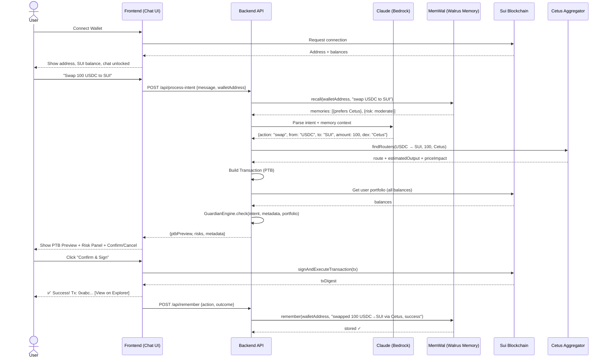
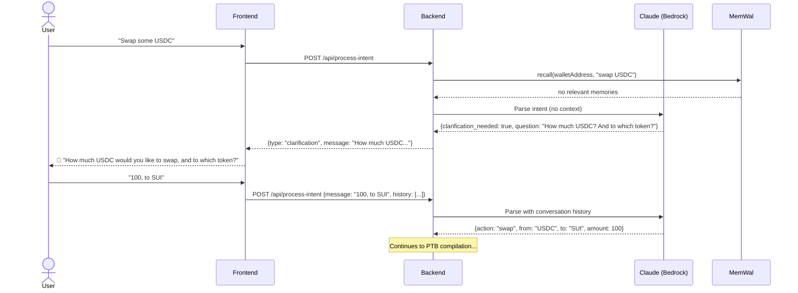
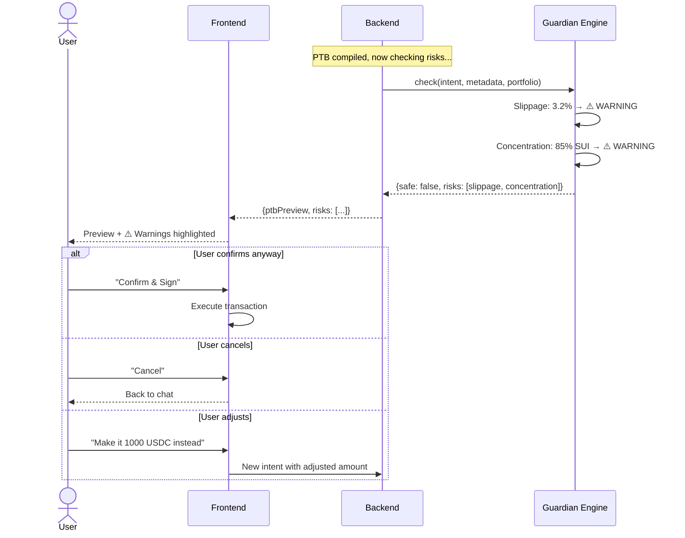

# Marina Copilot — UX Specification

## 1. User Journey

### First-Time User (No Memory)

```
1. User opens app → sees landing state with "Connect Wallet" prompt
2. User connects Sui wallet → sees balance, chat unlocks
3. User types: "Swap 100 USDC to SUI"
4. Copilot asks clarification (no memory yet): "Which DEX do you prefer? (Cetus, Turbos, or best route?)"
5. User responds: "Cetus"
6. Copilot compiles PTB → Guardian checks → shows preview:
   - Step-by-step breakdown
   - Risk warnings (if any)
   - Confirm / Cancel buttons
7. User clicks "Confirm & Sign"
8. Wallet popup → user signs
9. Tx executes → success message with explorer link
10. Copilot remembers: "prefers Cetus" + tx details
```

### Returning User (Has Memory)

```
1. User opens app → wallet auto-reconnects (or clicks connect)
2. User types: "Swap 100 USDC to SUI"
3. Copilot recalls memory → shows indicator: "💡 Using Cetus (your preferred DEX)"
4. Compiles PTB immediately → Guardian checks → shows preview
5. User confirms → executes → done
   (No clarification needed — memory filled the gaps)
```

### Risk Scenario

```
1. User types: "Swap 5000 USDC to SUI"
2. Copilot compiles PTB → Guardian detects:
   - ⚠️ High slippage (3.2% price impact)
   - ⚠️ Concentration (85% portfolio will be SUI)
3. Preview shows warnings prominently
4. User can:
   a. Confirm anyway (at their own risk)
   b. Cancel and adjust ("make it 1000 instead")
```

### Unsupported Intent

```
1. User types: "What's the weather today?"
2. Copilot responds: "I'm a DeFi assistant. I can help you swap tokens,
   stake SUI, deposit into lending, or transfer funds. What would you like to do?"
```

---

## 2. Sequence Diagram



### Clarification Flow (No Memory)



### Guardian Block Flow



---

## 3. UI Screens — Wireframe Checklist

### Screen 1: Landing / Not Connected

```
┌──────────────────────────────────────────────────┐
│  [Logo] Marina Copilot          [Connect Wallet]   │
├──────────────────────────────────────────────────┤
│                                                   │
│              🔒 Connect your wallet               │
│              to start chatting                    │
│                                                   │
│         [Connect Wallet] (large button)           │
│                                                   │
│    "Your AI-powered DeFi assistant on Sui"       │
│    "Swap, stake, deposit — just say the word."   │
│                                                   │
└──────────────────────────────────────────────────┘
```

**Checklist**:
- [ ] App logo + name in header
- [ ] Connect Wallet button (header, right)
- [ ] Center: lock icon + CTA text
- [ ] Large Connect Wallet button (center)
- [ ] Tagline / value proposition text
- [ ] Supported wallets shown (Sui Wallet, Suiet icons)

---

### Screen 2: Connected — Empty Chat

```
┌──────────────────────────────────────────────────┐
│  [Logo] Marina Copilot    0x1a2b...3c4d | 124 SUI │
├─────────┬────────────────────────────────────────┤
│         │                                         │
│ Memory  │   👋 Welcome! I'm your Marina Copilot.   │
│ Panel   │                                         │
│         │   I can help you:                       │
│ (empty) │   • Swap tokens                         │
│         │   • Stake SUI                           │
│         │   • Deposit into lending                │
│         │   • Transfer funds                      │
│         │                                         │
│         │   Just tell me what you'd like to do.  │
│         │                                         │
├─────────┴────────────────────────────────────────┤
│  [Type your financial goal here...]       [Send]  │
└──────────────────────────────────────────────────┘
```

**Checklist**:
- [ ] Header: logo, truncated address, SUI balance, disconnect button
- [ ] Sidebar: Memory Panel (collapsible on mobile)
  - [ ] "No memories yet" placeholder
  - [ ] Will populate after first interaction
- [ ] Chat area: Welcome message from assistant
  - [ ] Lists supported actions as bullet points
- [ ] Input bar: placeholder text, send button (icon), Enter key submits
- [ ] Input disabled until wallet connected

---

### Screen 3: User Sends Intent — Loading

```
┌──────────────────────────────────────────────────┐
│  [Logo] Marina Copilot    0x1a2b...3c4d | 124 SUI │
├─────────┬────────────────────────────────────────┤
│         │                                         │
│ Memory  │   👤 "Swap 100 USDC to SUI"            │
│ Panel   │                                         │
│         │   🤖 ···  (typing indicator)            │
│         │   "Compiling transaction..."            │
│         │                                         │
├─────────┴────────────────────────────────────────┤
│  [Type your financial goal here...]       [Send]  │
└──────────────────────────────────────────────────┘
```

**Checklist**:
- [ ] User message: right-aligned bubble, distinct color
- [ ] Assistant typing indicator: animated dots
- [ ] Status text below dots: "Recalling preferences..." → "Parsing intent..." → "Compiling transaction..." → "Checking risks..."
- [ ] Input bar disabled during processing
- [ ] Send button shows spinner or disabled state

---

### Screen 4: PTB Preview + Guardian (No Risks)

```
┌──────────────────────────────────────────────────┐
│  [Logo] Marina Copilot    0x1a2b...3c4d | 124 SUI │
├─────────┬────────────────────────────────────────┤
│         │                                         │
│ Memory  │   👤 "Swap 100 USDC to SUI"            │
│ Panel   │                                         │
│ ┌─────┐ │   🤖 💡 Using Cetus (your preferred)   │
│ │Pref:│ │                                         │
│ │Cetus│ │   ┌──────────────────────────────────┐ │
│ │1%   │ │   │ 📋 Transaction Preview            │ │
│ └─────┘ │   │                                    │ │
│         │   │ ① Split 100 USDC from wallet      │ │
│         │   │ ② Swap 100 USDC → ~24.8 SUI      │ │
│         │   │    via Cetus USDC/SUI pool         │ │
│         │   │    Rate: 1 SUI = $4.03             │ │
│         │   │    Min received: 24.55 SUI         │ │
│         │   │    Price impact: 0.12%             │ │
│         │   │ ③ Receive SUI to your wallet      │ │
│         │   │                                    │ │
│         │   │ Gas: ~0.003 SUI                    │ │
│         │   │                                    │ │
│         │   │ ✅ No risks detected               │ │
│         │   │                                    │ │
│         │   │ [✅ Confirm & Sign] [❌ Cancel]    │ │
│         │   └──────────────────────────────────┘ │
│         │                                         │
├─────────┴────────────────────────────────────────┤
│  [Type your financial goal here...]       [Send]  │
└──────────────────────────────────────────────────┘
```

**Checklist**:
- [ ] Memory indicator: "💡 Using Cetus (your preferred)" — shown when memory applied
- [ ] PTB Preview card:
  - [ ] Title: "📋 Transaction Preview"
  - [ ] Numbered steps with icons
  - [ ] Each step: action description + amounts
  - [ ] Metadata: rate, min received, price impact, gas
  - [ ] Green "No risks detected" badge (if clean)
  - [ ] Confirm button: primary style, prominent
  - [ ] Cancel button: secondary/ghost style
- [ ] Sidebar: populated with recalled memory items
- [ ] Input bar: still accessible (user can cancel and type new intent)

---

### Screen 5: PTB Preview + Guardian (With Risks)

```
┌──────────────────────────────────────────────────┐
│  [Logo] Marina Copilot    0x1a2b...3c4d | 124 SUI │
├─────────┬────────────────────────────────────────┤
│         │                                         │
│ Memory  │   👤 "Swap 5000 USDC to SUI"           │
│ Panel   │                                         │
│         │   🤖 ┌────────────────────────────────┐│
│         │      │ 📋 Transaction Preview          ││
│         │      │                                  ││
│         │      │ ① Split 5000 USDC              ││
│         │      │ ② Swap 5000 USDC → ~1240 SUI  ││
│         │      │    Rate: 1 SUI = $4.03          ││
│         │      │    Price impact: 3.2%           ││
│         │      │                                  ││
│         │      │ ⚠️ WARNINGS                     ││
│         │      │ ┌──────────────────────────────┐││
│         │      │ │ 🟡 High Slippage             │││
│         │      │ │ Price impact 3.2%. You'll    │││
│         │      │ │ lose ~$160 vs spot price.    │││
│         │      │ │ Consider splitting into      │││
│         │      │ │ smaller trades.              │││
│         │      │ └──────────────────────────────┘││
│         │      │ ┌──────────────────────────────┐││
│         │      │ │ 🟠 Concentration Risk        │││
│         │      │ │ After this trade, 85% of     │││
│         │      │ │ your portfolio will be SUI.  │││
│         │      │ │ Consider diversifying.       │││
│         │      │ └──────────────────────────────┘││
│         │      │                                  ││
│         │      │ [⚠️ Confirm Anyway] [❌ Cancel] ││
│         │      └────────────────────────────────┘│
│         │                                         │
├─────────┴────────────────────────────────────────┤
│  [Type your financial goal here...]       [Send]  │
└──────────────────────────────────────────────────┘
```

**Checklist**:
- [ ] Risk section: "⚠️ WARNINGS" header
- [ ] Each risk: bordered card with severity color
  - [ ] 🟡 Yellow border = warning
  - [ ] 🟠 Orange border = elevated
  - [ ] 🔴 Red border = danger
  - [ ] Title: risk class name
  - [ ] Body: plain-language explanation + actionable suggestion
- [ ] Confirm button changes style when risks present:
  - [ ] Text: "⚠️ Confirm Anyway" (instead of "✅ Confirm & Sign")
  - [ ] Color: yellow/orange (instead of green)
- [ ] Cancel remains normal
- [ ] Price impact highlighted in red in step details

---

### Screen 6: Transaction Executing

```
┌──────────────────────────────────────────────────┐
│         │                                         │
│         │   🤖 ⏳ Executing transaction...        │
│         │      ████████░░░░ Waiting for confirm   │
│         │                                         │
└──────────────────────────────────────────────────┘
```

**Checklist**:
- [ ] After user clicks Confirm: preview card collapses or dims
- [ ] Loading state: spinner + "Executing transaction..."
- [ ] Progress hint: "Waiting for wallet signature..." → "Submitting to network..." → "Confirming..."
- [ ] Input disabled during execution

---

### Screen 7: Transaction Success

```
┌──────────────────────────────────────────────────┐
│         │                                         │
│         │   🤖 ┌────────────────────────────────┐│
│         │      │ ✅ Transaction Successful!       ││
│         │      │                                  ││
│         │      │ Swapped 100 USDC → 24.82 SUI   ││
│         │      │                                  ││
│         │      │ Tx: 0x7f3a...b2c1               ││
│         │      │ [View on Sui Explorer ↗]        ││
│         │      │                                  ││
│         │      │ 💾 Saved to memory              ││
│         │      └────────────────────────────────┘│
│         │                                         │
│         │   What else can I help with?            │
│         │                                         │
├─────────┴────────────────────────────────────────┤
│  [Type your financial goal here...]       [Send]  │
└──────────────────────────────────────────────────┘
```

**Checklist**:
- [ ] Success card: green accent/border
  - [ ] "✅ Transaction Successful!" header
  - [ ] Summary: what was done + actual amounts received
  - [ ] Tx hash (truncated) + copy button
  - [ ] "View on Sui Explorer" external link
  - [ ] "💾 Saved to memory" indicator (confirms MemWal stored)
- [ ] Follow-up message: "What else can I help with?"
- [ ] Input re-enabled
- [ ] Sidebar: memory panel updates with new entry

---

### Screen 8: Transaction Failed

```
┌──────────────────────────────────────────────────┐
│         │                                         │
│         │   🤖 ┌────────────────────────────────┐│
│         │      │ ❌ Transaction Failed            ││
│         │      │                                  ││
│         │      │ Reason: Insufficient USDC       ││
│         │      │ balance (have 45, need 100)     ││
│         │      │                                  ││
│         │      │ 💡 Try: "Swap 45 USDC to SUI"  ││
│         │      └────────────────────────────────┘│
│         │                                         │
├─────────┴────────────────────────────────────────┤
│  [Type your financial goal here...]       [Send]  │
└──────────────────────────────────────────────────┘
```

**Checklist**:
- [ ] Error card: red accent/border
  - [ ] "❌ Transaction Failed" header
  - [ ] Reason in plain language (not raw error)
  - [ ] Suggestion: what user can do instead
- [ ] Input re-enabled for retry

---

### Screen 9: Clarification Dialog

```
┌──────────────────────────────────────────────────┐
│         │                                         │
│         │   👤 "Put my money somewhere safe"      │
│         │                                         │
│         │   🤖 I'd like to help! A few options:  │
│         │                                         │
│         │   • Stake SUI (~4.2% APY)              │
│         │   • Deposit USDC to Scallop (~8.5% APY)│
│         │   • Deposit SUI to lending (~3.1% APY) │
│         │                                         │
│         │   Which sounds best? Or tell me more   │
│         │   about what you're looking for.        │
│         │                                         │
├─────────┴────────────────────────────────────────┤
│  [Type your financial goal here...]       [Send]  │
└──────────────────────────────────────────────────┘
```

**Checklist**:
- [ ] Clarification presented as helpful options (not error)
- [ ] Options include current APY/rates when applicable
- [ ] Conversational tone — not a form
- [ ] User can reply naturally ("the second one", "Scallop", "deposit USDC")

---

### Screen 10: Memory Panel (Sidebar)

```
┌─────────┐
│ 🧠 Memory│
├─────────┤
│         │
│ Prefs   │
│ ┌─────┐ │
│ │Cetus│×│
│ │1% sl│×│
│ │mod. │×│
│ └─────┘ │
│         │
│ Recent  │
│ ┌─────┐ │
│ │Swap │ │
│ │100  │ │
│ │USDC │ │
│ │→SUI │ │
│ │Jun 5│ │
│ └─────┘ │
│ ┌─────┐ │
│ │Stake│ │
│ │50   │ │
│ │SUI  │ │
│ │Jun 5│ │
│ └─────┘ │
│         │
│[Clear ↗]│
└─────────┘
```

**Checklist**:
- [ ] Header: "🧠 Memory" with collapse toggle
- [ ] Section: Preferences
  - [ ] Each preference as chip/tag
  - [ ] "×" button to delete individual memory
- [ ] Section: Recent Actions
  - [ ] Last 5 transactions (summarized)
  - [ ] Each shows: action type, amount, date
- [ ] Footer: "Clear all memory" link (with confirmation dialog)
- [ ] Collapsible on mobile (hamburger or drawer)
- [ ] Empty state: "No memories yet — I'll learn as we interact"

---

## 4. Interaction States Summary

| State | Chat Area | Input Bar | Sidebar |
|-------|-----------|-----------|---------|
| Not connected | "Connect wallet" CTA | Disabled | Hidden |
| Connected, empty | Welcome message | Enabled, placeholder | Empty state |
| Processing | User msg + typing indicator | Disabled + spinner | Unchanged |
| Preview shown | PTB card + risks | Enabled (can cancel via text) | Unchanged |
| Executing | Loading state | Disabled | Unchanged |
| Success | Success card | Enabled | Updates with new memory |
| Error | Error card + suggestion | Enabled | Unchanged |
| Clarification | Assistant question | Enabled | Unchanged |

---

## 5. Responsive Behavior

| Viewport | Layout |
|----------|--------|
| Desktop (>1024px) | Sidebar visible + Chat area |
| Tablet (768-1024px) | Sidebar collapsible (toggle button) |
| Mobile (<768px) | Sidebar as bottom sheet / drawer, full-width chat |
